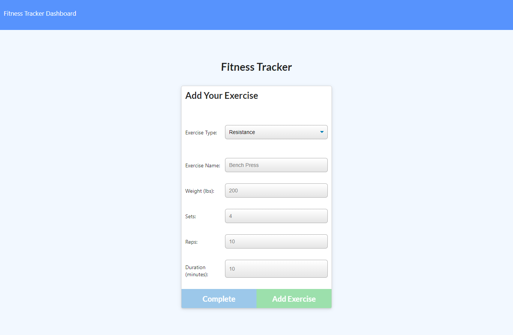
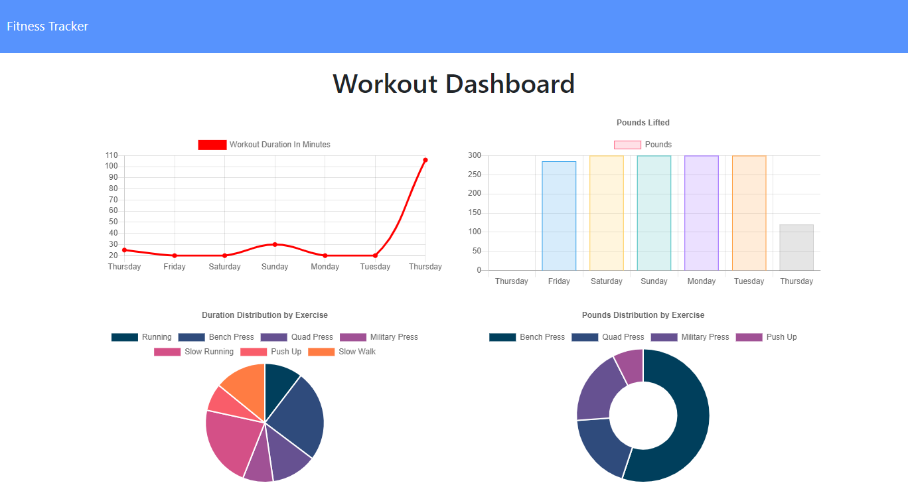

# **Fitness Tracker**

[](#) [](#) [](#) [](#) [](#)

 

### **Table of Contents**

- [Description](#description)
- [How to Use](#how-to-use)
- [How to Install](#how-to-install)
- [License](#license)
- [Author Info](#author-info)

# Desription

This project builds a workout tracker with Express.js and MongoDB. User can start a workout plan and each plan can track multiple exercises. This application tracks two type of exercises: resistance and cardio. For resistance, the application tracks weight, reps, sets. For cardio exercises, it tracks ditances. After all, the duration of every exercises will be tracked as well. User can see the summary for their current workout plan at the main mage. If user wants more detailed data, he/she can view dashboard for detailed graphs and distributions of exercises performed over the last 7 workout plans.

[Back to the Top](#fitness-tracker)

## :wrench: **Technologies Used**

- MongoDB
- Mongoose
- Express.js
- Node.js
- RESTful Api
- Chart.js
- Bootstrap 5
- HTML 5
- CSS 3
- JavaScript
- VS Code
- Heroku

[Back to the Top](#fitness-tracker)

# How to Use

:crystal_ball: This application helps user track different exercises under the same workout plan. Exercises are categoried into two major groups: cardio and resistance. There are four main features: adding cardio, adding resistance, viewing summary of current workoutplan, exploring data dashboard for past 7 workout plans.

## :swimmer: **Feature: Adding a New Cardio Exercise**

To add a new cardio exercise, user need to enter the name of the exercise, distance in miles and its duration.


[Back to the Top](#fitness-tracker)

## :muscle: **Feature: Adding a New Resistance Exercise**

To add a new resistance exercise, user need to enter the name of the exercise, weights, setss, reps, and its duration.



[Back to the Top](#fitness-tracker)

## :sweat_drops: **Feature: Summary of Current Workout Plan**

The summary is automatically generated upon launching or returning to homepage (by clicking on `Fitness Tracker` on the top left corner).


[Back to the Top](#fitness-tracker)

## :bar_chart: **Feature: Dashboard of Last 7 Workout Plans**

By clicking on `Dashboard` on the top left corner, user will be taken to a dashboard for different statistics for last 7 workout plans.



[Back to the Top](#fitness-tracker)

# How to Install

:cd: To use this application locally, you need MongoDB community server installed. Type this command in command-line to check:

```bash
mongo --version
```

Once you have MongoDB installed, install the require packages, you will need mongoose to use the seed function, use the following command:

```bash
npm install
```

The last step would be seeding, use this command:

```bash
npm run seed
```

[Back to the Top](#fitness-tracker)

:computer: To initialize the server, type this command in console, then use the application through brower.

```bash
npm start
```

[Back to the Top](#fitness-tracker)

# License

This project is licensed under the MIT License.

[Back to the Top](#fitness-tracker)

 
